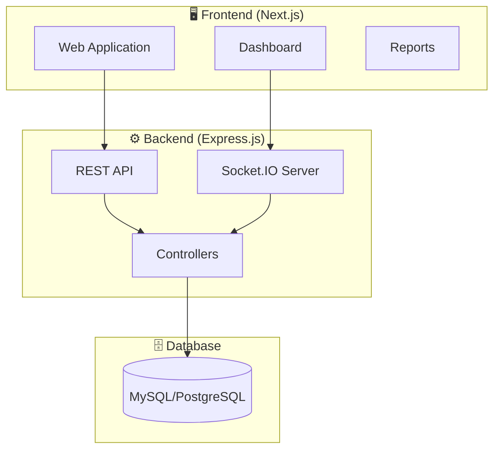
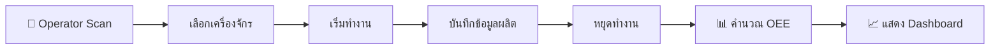
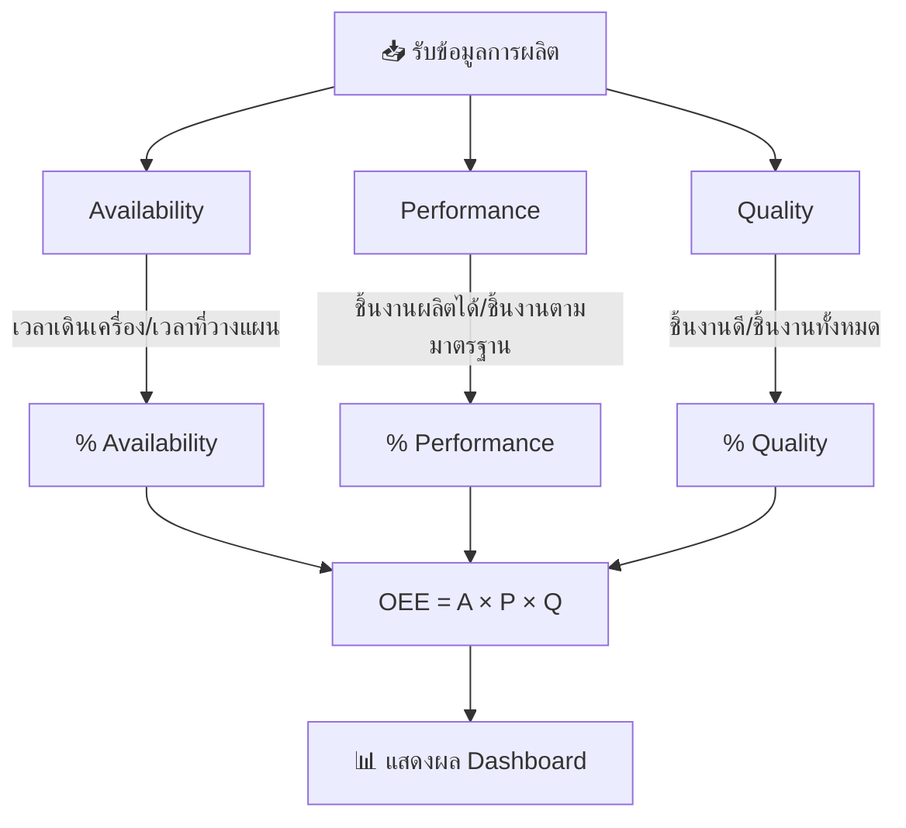

# OEE_FDB - OEE Production Monitoring System

ระบบ OEE (Overall Equipment Effectiveness) สำหรับติดตามและวิเคราะห์ประสิทธิภาพของเครื่องจักรในโรงงาน

## 🎯 Objective

ระบบนี้ถูกพัฒนาขึ้นเพื่อ:
- ติดตามสถานะการทำงานของเครื่องจักรแบบ Real-time
- บันทึกข้อมูลการทำงานของ Operator
- คำนวณและแสดงผล OEE (Availability, Performance, Quality)
- สร้างรายงานและวิเคราะห์ข้อมูลการผลิต

## 📈 Flow Chart

### System Architecture


### User Flow


### OEE Calculation Flow


## 🛠️ Tech Stack

### Backend
- **Node.js** + **Express.js** - REST API Server
- **Prisma ORM** - Database Management
- **Socket.IO** - Real-time Communication
- **Day.js** - Date/Time Handling

### Frontend
- **Next.js 16** - React Framework
- **React 19** - UI Library
- **Bootstrap 5** + **AdminLTE 4** - UI Components
- **Chart.js** - Data Visualization
- **Socket.IO Client** - Real-time Updates

## 📁 Project Structure

```
OEE_FDB/
├── backend/                 # Backend API Server
│   ├── controllers/         # API Controllers
│   ├── prisma/              # Database Schema & Migrations
│   ├── server.js            # Main Server Entry
│   └── package.json
│
├── fontend/                 # Frontend Application
│   ├── src/
│   │   └── app/
│   │       ├── machine_working/         # Machine Working Page
│   │       ├── overall_machine_working/ # Overall Dashboard
│   │       ├── oee_production/          # OEE Production Pages
│   │       └── components/              # Shared Components
│   ├── public/              # Static Assets
│   └── package.json
│
└── README.md
```

## 🚀 Installation & Setup

### Prerequisites
- Node.js v18+ 
- npm or yarn
- Database (MySQL/PostgreSQL)

### 1. Clone Repository
```bash
git clone https://github.com/ApiwatN/OEE_FDB.git
cd OEE_FDB
```

### 2. Backend Setup
```bash
cd backend
npm install

# Configure environment variables
# Create .env file with database connection

# Run Prisma migrations
npx prisma migrate deploy
npx prisma generate

# Start server
node server.js
```

### 3. Frontend Setup
```bash
cd fontend
npm install

# Development mode
npm run dev

# Production build
npm run build
npm run start
```

## ⚙️ Configuration

### Backend Environment Variables (.env)
```env
DATABASE_URL="your-database-connection-string"
JWT_SECRET="your-jwt-secret"
PORT=3001
```

### Frontend Configuration
Frontend runs on port 5000 in production mode, port 3000 in development mode.

## 📊 Features

- **Machine Working Tracking** - บันทึกเวลาทำงานของเครื่องจักร
- **Operator Management** - จัดการข้อมูล Operator
- **Real-time Dashboard** - แสดงสถานะเครื่องจักรแบบ Real-time
- **OEE Calculation** - คำนวณ OEE อัตโนมัติ
- **Production Reports** - สร้างรายงานการผลิต
- **Export to Excel** - ส่งออกข้อมูลเป็นไฟล์ Excel

## 📝 License

ISC License

## 👤 Author

ApiwatN
